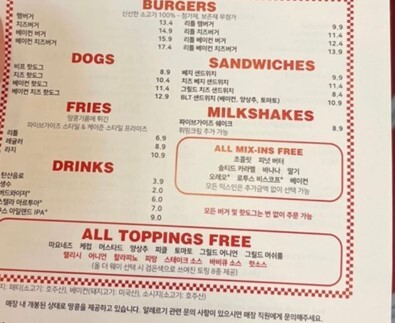

- [TODO](#todo)
- [PS](#ps)
  - [Codeforces](#codeforces)
    - [A. Forbidden Integer](#a-forbidden-integer)
    - [B. Come Together](#b-come-together)
    - [C. Strong Password](#c-strong-password)
    - [D. Rating System](#d-rating-system)
  - [일일퀘스트](#일일퀘스트)
    - [도로검문](#도로검문)
    - [버스 노선](#버스-노선)
    - [교차하지 않는 원의 현들의 최대집합](#교차하지-않는-원의-현들의-최대집합)
- [개발](#개발)
  - [React Js](#react-js)
- [하루 하나](#하루-하나)

# TODO

- [ ] 운동
- [x] codeforce 1세트
- [x] 일일퀘스트
- [ ] 포스팅
- [ ] 책읽기
- [x] 뉴스 훑기
- [x] 개발 

# PS 

## Codeforces 

[Educational Codeforces Round 151 (Rated for Div. 2)](https://codeforces.com/contest/1845)

늘 그렇듯 별다른 알고리즘이 어려워서가 아니라

떠올리지 못해서 풀지 못 하였다.

어떻게 하면 이렇게 풀 수 있을까, 다음에 나오면 어떻게 생각해낼까에 집중하자.

### A. Forbidden Integer

[Link](https://codeforces.com/contest/1845/problem/A)

풀이는 바로 떠올렸으나 케이스 분류에서 조금 버벅인 문제.

머리속으로 못 하겠으면 일일이 써가면서 케이스 분류를 하자

### B. Come Together

[Link](https://codeforces.com/contest/1845/problem/B)

문제를 제대로 읽지 않아서 한참 고민한 문제. 

문제를 제대로 이해하지 않았다면 문제를 풀지 말자. 

이 문제도 케이스 분류를 하는 문제였는데 매끄럽지 못했다. 

막상 코드는 30줄도 안 되는데...

### C. Strong Password

[Link](https://codeforces.com/contest/1845/problem/C)

그리디하게 내가 찾고자 하는 문자열이 없는지 확인하는 문제이다.

찾고자 하는 문자열의 접미사가 동일하기 때문에

최대한 뒤의 문자를 찾아서 타겟 문자열의 길이를 넘기는 문제.

재밌었다.

### D. Rating System

[Link](https://codeforces.com/contest/1845/problem/D)

알듯말듯 정말 나를 애태운 문제.

풀이를 보고도 완벽히 이해하지 못했다.

다시 풀어보자.

## 일일퀘스트 

### 도로검문

[도로검문](https://www.acmicpc.net/problem/2307)

다익스트라 최적화에 대해 생각해 보는 문제이다.

개인적으로 이 문제를 풀면서 worst case가 들어간다면 

시간 초과가 날 거라는 생각을 했지만 적당히 최적화를 하니 맞아버린 문제.

정해를 찾아보니 나와 같았다. 

**다익스트라의 시간 복잡도는 O(ElogV)**

$1000 * 5000 * log(1000) = 160000000$

이 정도면 돌아가는구나~ 생각하자.

### 버스 노선

[버스 노선](https://www.acmicpc.net/problem/10165)

원형으로 이루어진 배열을 스위핑하는 문제

한 바퀴 이후의 값을 `+N`을 하여 `마치~ 다른 수인 것처럼` 

누군가 생각나네.

### 교차하지 않는 원의 현들의 최대집합 

[교차하지 않는 원의 현들의 최대집합](https://www.acmicpc.net/problem/2673)

떠올리기까지 쉽지 않지만 막상 코드는 50줄도 안 되는~

요즘 이런 문제를 보면 가슴이 뛴다.

~~나 PS 사랑하냐.~~

나중에 다시 풀어 보자.

# 개발 

## React Js

무언가를 만들어봐야 되는데

아이디어가 떠오르지 않는다.

일단 지금 생각 중인 것은 

`뭐 먹고 살까`라는 취업 사이트 이다.

자신의 학과, 성향, 지역 등을 고려하여 

뭐 먹고 살지 고민하는 사람들에게 적절한 직업을 추천해주는 사이트를 만들어 보려 한다.

# 하루 하나

일상이 지루해서 뭔가 자꾸 하고 싶어진다.

일주일에 하루 정도 새로운 도전을 하는 날로 정했다.

이번에는 미국에서 갓 들어온 햄버거 맛집 `Five Guys`를 갈 것이다.

그렇다면 가장 맛있는 조합에 대해 생각해 보자.

[미국 직원이 추천해주는 조합](https://www.youtube.com/watch?v=hrIllXoLgBo&t=621s)

베이컨 치즈 버거

밀크 쉐이크 (초코렛, 솔티드 카레멜, 베이컨, 피넛버터) -> 액체 스니커즈 맛이 난다고 한다.

일단 미국 현지의 맛을 느끼기 위해 리틀버거는 배제하고

패티 2장의 풍부함을 느껴보도록 베이컨 치즈버거 (17400원) 먹자.

영상 보는데 침이 줄줄 샌다. 

빨리 먹고 싶다.

