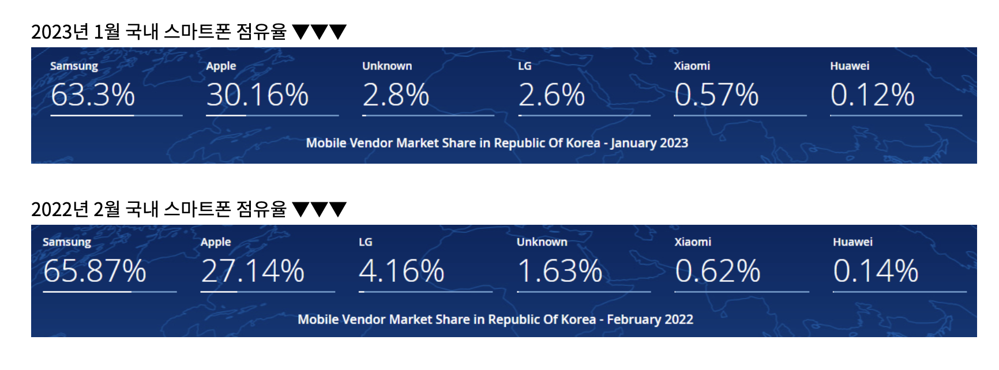
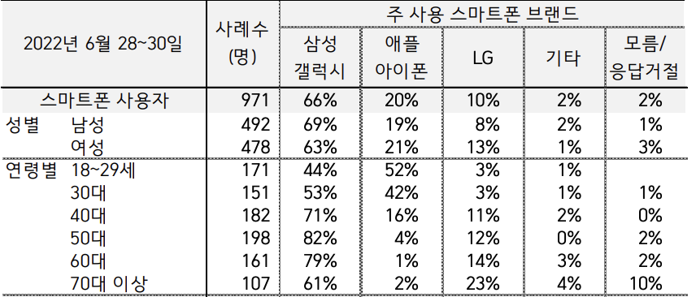

시험 기간이라 TID를 간략히 쓰도록 하겠다.
# Hanyang

- 오늘도 하루종일 운체 공부를 하였다.
- 시험이 다 끝난 거 같은 기분이 든다.

# 하루 하나

## 삼성 vs 애플

요즘 주변을 돌아보면 아이폰밖에 보이지 않는다. 

삼성 주주로서 삼성의 인기가 여전한지 알아보자.

### 2023년 조사 결과 

놀랍게도 삼성이 압도적으로 인기가 많았다. 

아니 왜? 궁금해진 나는 연령별 사용현황을 알아보지 않을 수 없었다.

### 연령별 스마트폰 사용현황

40대부터 삼성이 압도적으로 인기가 많아 전체 점유율이 삼성이 높게 나오는 것이였다.

10-20년 뒤에는 애플 주주로 전향해야겠다.
